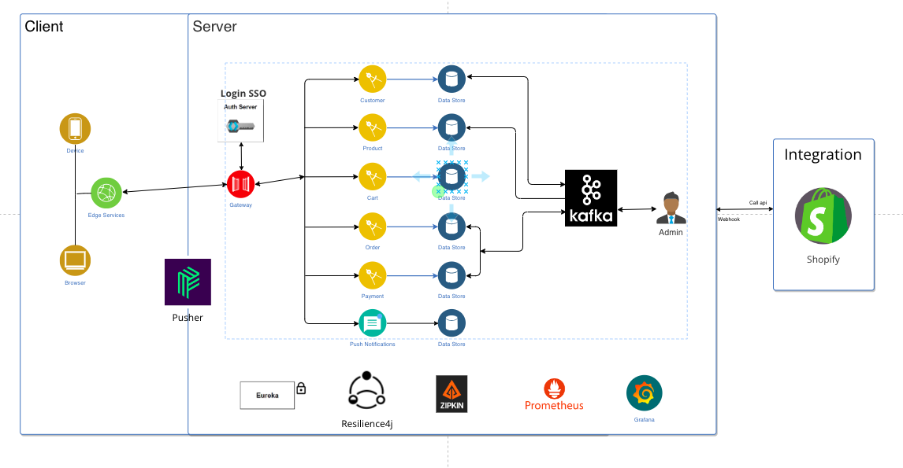

# Microservices-Clothes-Store_Graduation-Project_BE

# Table of Contents

- [Plan](#plan)
- [Technologies - Libraries](#technologies---libraries)
- [Application Architecture](#application-architecture)
- [Vertical Slice Flow](#vertical-slice-flow)
- [Demo](#Demo)

## Plan

> This project is in progress, New features will be added over time.

| Feature          | Status         |
| ---------------- | -------------- | 
| Discovery Service| Completed ✔️   |
| API Gateway      | Completed ✔️   |
| Order Service    | Completed ✔️   |
| Admin Service    | Completed ✔️   |
| Product Service  | Completed ✔️   |
| Customer Service | In Progress👷  |                                                                                                                  
| Shipping Service | Not Started 🚩 |
| Auth Service | Not Started 🚩 |
| Payment Service | Not Started 🚩 |
| Nofication Service | Not Started 🚩 |
| Inventory Service | Not Started 🚩 |
| Shipping Service | Not Started 🚩 |

## Technologies - Libraries
1. Java
1. Spring-boot 3.13
1. Spring-security
1. Spring-cloud/Spring-cloud-eureka/Spring-cloud-gateway
1. MySQL
1. Keycloack
1. Docker/Docker-compose/DockerFile
1. Zipkin
1. Kafka
1. Shopify

## Application Architecture

## Demo

[Click here to watch the video](https://www.loom.com/share/586f66a97b86414f87b294a10fb65f13)

